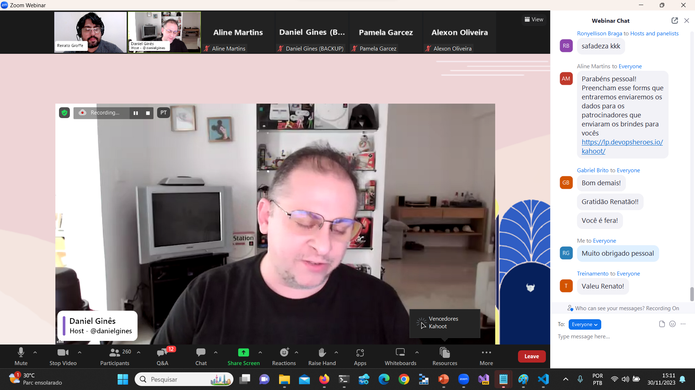

# KEDA_DevOpsExperience-Nov2023
Materiais de apresentação sobre KEDA (Kubernetes Event-Driven Autoscaling) realizada durante a edição de Novembro-2023 do DevOps Experience.

Título da Apresentação: **KEDA + Aplicações no Kubernetes - Escalando seus deployments de forma mais racional**

Data: **30/11/2023 (quinta-feira)**

Tipo do evento: **Online**

Ferramenta de transmissão: **Zoom**

Tecnologias utilizadas: **Kubernetes, KEDA, Azure Kubernetes Service (AKS), .NET 8, ASP.NET Core**

Número de participantes: **285 pessoas (pico de audiência ao longo da live)**

Link do evento: [**Instagram**](https://www.instagram.com/p/C0AYVGxOUnG/?img_index=1)

Deixo aqui meus agradecimentos ao **Daniel Ginês** e à **Aline Martins** por todo o apoio para que eu partipasse como palestrante de mais uma edição do **DevOps Experience**.

---

